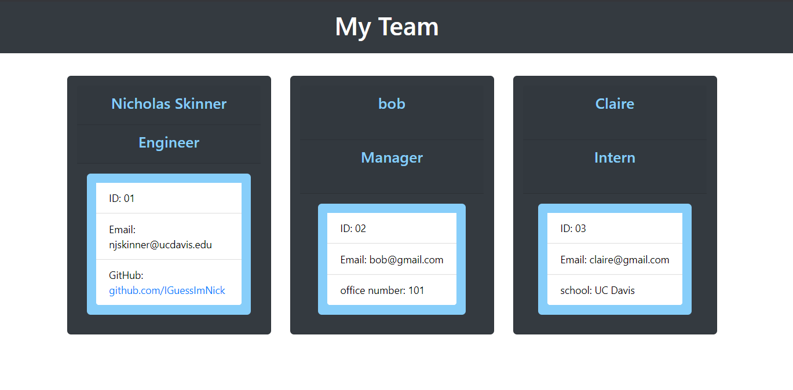

# homework-10-team-profile-generator

## Description
This is a command line app that builds a webpage of your team, with individual team members displayed on cards.

## Video Link

https://drive.google.com/file/d/1FUJmHU2iZ5yCuVwhvA110jOSjNcmKr8W/view

## Deployed webpage

https://iguessimnick.github.io/homework-10-team-profile-generator/

## Operations
1. Initialize the npm suites
    a. open the intregrated terminal on the index.js file
    b. type <npm init -y> into the integrated termainal
    c. install npm suites with <npm i __suitename> 
        1. inquirer
        2. fs
        3. jest
2. Test the app to make sure it is running with the jest npm suite
    a. open the package.json
    b. verify jest dependency
    c. set test to "jest"
    d. run <npm test> in the terminal
    e. verify all pass
3. node index.js
4. Response to the various prompts to build your team
5. Navigate to the newFile.html file and open in your preferred browser

## Website URL
https://github.com/IGuessImNick/homework-10-team-profile-generator

## Tech/Framework
Built with:
    HTML
    CSS
    JavaScript
    NPM: inquirer, fs, jest
    Node.js

## Authors and Acknowledgment
* Nick Skinner

## Known Bugs

## License
Copyright [2021] [##Authors]

Licensed under the Apache License, Version 2.0 (the "License");
you may not use this file except in compliance with the License.
You may obtain a copy of the License at

    http://www.apache.org/licenses/LICENSE-2.0

Unless required by applicable law or agreed to in writing, software
distributed under the License is distributed on an "AS IS" BASIS,
WITHOUT WARRANTIES OR CONDITIONS OF ANY KIND, either express or implied.
See the License for the specific language governing permissions and
limitations under the License.